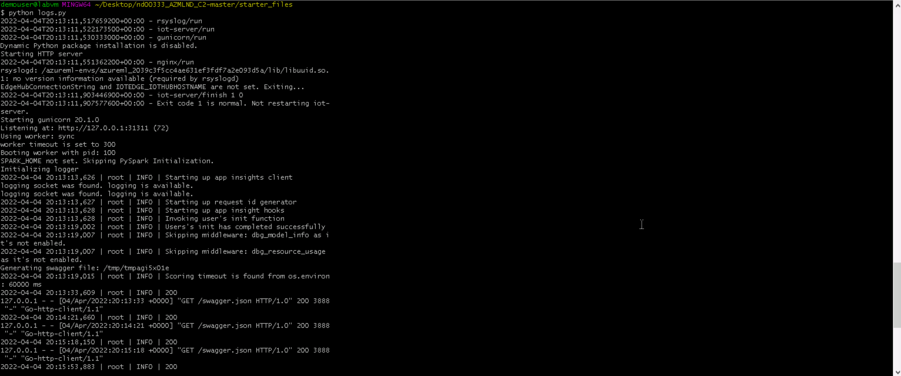
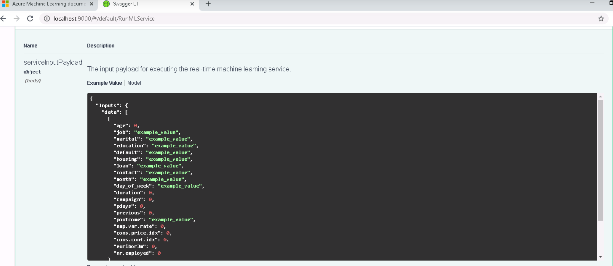
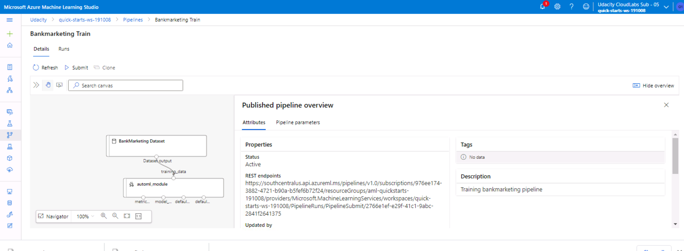
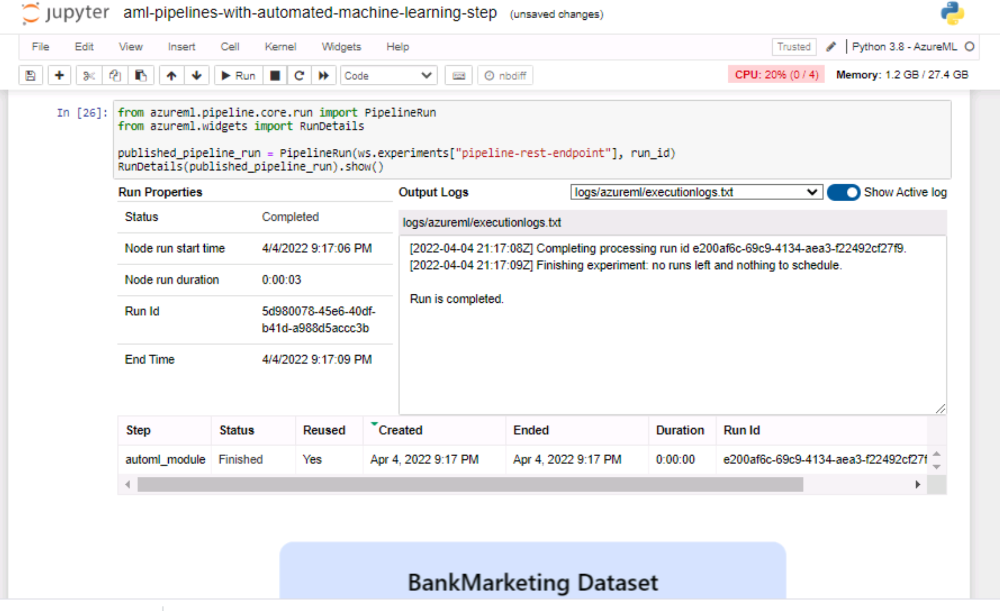
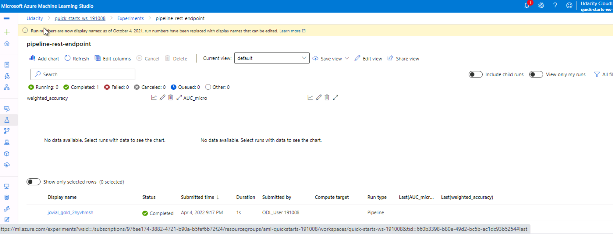
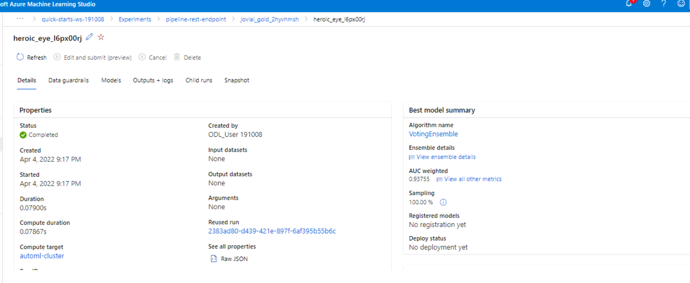
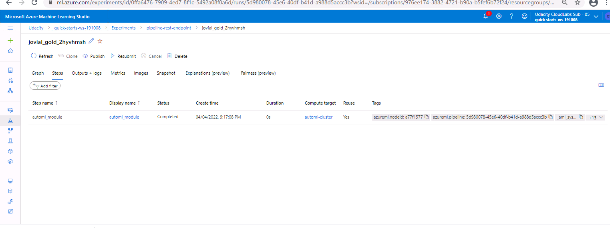

# Operationalizing Machine Learning 

## This project is based on a [bank's marketing campaign](https://automlsamplenotebookdata.blob.core.windows.net/automl-sample-notebook-data/bankmarketing_train.csv). Using Azure Machine Learning Studio, obtained the best performing model with AutoML, this model was then deployed, logging & application insights were enabled, model endpoints were consumed, and a pipeline was created and published.


## Architectural Diagram


### Project Main Steps:

1. [Authentication](#auth)
2. [Automated ML Experiment](#automate)
3. [Deploy the best model](#deploy)
4. [Enable logging](#logging)
5. [Swagger Documentation](#swagger)
6. [Consume model endpoints](#endpoints)
7. [Create and publish a pipeline](#pipeline)
8. [Documentation Video](#video)

## Step 1: Authentication<a name="auth"></a>
I skipped this step due to the lab Udacity provided, I was not authorized to create a security principal. 

## Step 2: Automated ML Experiment<a name="automate"></a>
In this step, I created an experiment using Automated ML, configured a compute cluster, and used that cluster to run the experiment.
* Created Compute Instance called automl-inst using STANDARD_DS12_V2
* Created Compute Cluster called automl-cluster STANDARD_DS12_V2 (Minimum 1 node & 4 Node Max)
* Uploaded & Registered the [bankmarketing_train.csv](https://automlsamplenotebookdata.blob.core.windows.net/automl-sample-notebook-data/bankmarketing_train.csv)  to Azure Machine Learning Studio so that it can be used when training the model.
#### Registered Dataset


* Created a new AutoML experiment on the compute cluster called ml-experiment-a: using the bankmarketing dataset (target column "y") and applying Classification to find the best model

#### Experiment Completed
![Experiment Completed(experiment_complete.PNG)

#### Best Model Summary (VotingEnsemble): 


## Step 3: Deploy the Best Model<a name="deploy"></a>
After the experiment run completes, a summary of all the models and their metrics are shown, including explanations. The Best Model is shown in the Details tab. In the Models tab, it will come up first (at the top). Deploying the Best Model will allow the model to interact with the HTTP API service and interact with the model by sending data over POST requests.

* Selected the best model for deployement (VotingEnsemble)
* Deployed the model (demo-model-deploy) and enabled "Authentication"
* Deployed the model (demo-model-deploy) using using Azure Container Instance (ACI)
	
## Step 4: Enable logging<a name="logging"></a>
Now that the Best Model is deployed, enabled Application Insights and retrieved logs.
* Downloaded the config.json file from the top left menu in the Azure portal and placed in project folder directory
* Using Git Bash, ensured az & ab are available, changed directory to location of project files including the downloaded config.json file
* Updated logs.py file to include:
```
		# Set with the deployment name
		name = "demo-model-deploy"
		service.update(enable_app_insights=True)
```

* Executed: python logs.py 

* Application Insights Enabled


## Step 5: Swagger Documentation<a name="swagger"></a>
In this step, I consumed the deployed model using Swagger. Azure provides a Swagger JSON file for deployed models. Under the Endpoints section, located the deployed model, it should be the first one on the list.

* Download swagger.json (using save as) and placed in project directory.
* Download the latest Swagger container, and run on port 9000 by executing: bash swagger.sh (swagger.sh was updated from port 80 to 9000, 80 was already in use)
* Execute: python serve.py which will start a Python server on port 8000. This script needs to be in the same directory as the newly downloaded swagger.json file. NOTE: This will not work if swagger.json is not on the same directory
* Execute: python serve.py
* In new Git Bash window, excute: python serve.py in the project directory folder
* In a new browser, launched http:localhost:9000
* In the Swagger instance, typed http://localhost:8000/swagger.json to interact with the swagger documentation for the deployed model - demo-model-deploy

#### demo-model-deploy Swagger Documentation, HTTP API Methods, and responses for the model 





## Step 6: Consume model endpoints <a name="endpoints"></a>
Now that model is deployed, used the endpoint.py script provided to interact with the trained model. 

* In this step, I modified both the scoring_uri and the key to match the key for my service and the URI that was generated after deployment in the endpoint.py file.  Scoring_uri is from the Endpoints deployed model Basic Consumption info section (REST endpoint uri) and key is from the Authentication section (primary key)


* Added two sets of data to score, will return {"result":["yes", "no"]}
```

		data = {
		    "Inputs": {
			"data":
			[
			    {
				"age": "53",
				"job": "technician",
				"marital": "married",
				"education": "professional.course",
				"default": "no",
				"housing": "no",
				"loan": "yes",
				"contact": "cellular",
				"month": "jul",
				"day_of_week": "tue",
				"duration": "178",
				"campaign": "11",
				"pdays": "999",
				"previous": "0",
				"poutcome": "nonexistent",
				"emp.var.rate": "1.4",
				"cons.price.idx": "93.918",
				"cons.conf.idx": "-42.7",
				"euribor3m": "4.961",
				"nr.employed": "5228.1"
			    },
			    {
				"age": "24",
				"job": "blue-ollar",
				"marital": "married",
				"education": "professional.course",
				"default": "no",
				"housing": "no",
				"loan": "yes",
				"contact": "cellular",
				"month": "may",
				"day_of_week": "tue",
				"duration": "178",
				"campaign": "1",
				"pdays": "999",
				"previous": "1",
				"poutcome": "nonexistent",
				"emp.var.rate": "-1.4",
				"cons.price.idx": "93.918",
				"cons.conf.idx": "-46.7",
				"euribor3m": "1.961",
				"nr.employed": "6228.1"
			    },
			]
		    } 

```
*Excuted: python endpoint.py

#### Screenshot of the endpoint.py run against the API producing JSON output from the model): 


#### Load-Tested the Model

* Updated the benchmark.sh file 
 ```
 	ab -n 10 -v 4 -p data.json -T 'application/json' -H 'Authorization: Bearer REPLACE_WITH_KEY' http://REPLACE_WITH_API_URL/score
 	
 ```

* Replaced REPLACE_WITH_KEY with the key from the Authentication section (primary key) in the endpoint deployed model tab 
replaced http://REPLACE_WITH_API_URL/score with the REST endpoint URI from the deployed model Basic Consumption info section in the endpoint deployed model tab

* Using the data.json file that was produced from the endpoint.py run, executed bash benchmark.sh

#### Screenshot benchmark.sh Run


Step 7: Create, Publish and Consume a Pipeline<a name="pipeline"></a>
For this part of the project, I used the Jupyter Notebook provided in the starter files. I updated the notebook to have the same keys, URI, dataset, cluster, and model names already created. 

* Uploaded the Jupyter Notebook - aml-pipelines-with-automated-machine-learning-step.ipynb to the Azure ML studio
* Updated all the variable to match my environment
* Validated the config.json file has been downloaded in the project working directory
* Ran each cell
* Verified the pipeline was created and shows in Azure ML Studio (pipelines section)

* Verified that the pipeline was scheduled and ran

* Bankmarketing Dataset with the AutoML module

* Jupyter Notebook, Run Details Widget

* ML Studio, Scheduled Run






## Step 8: Documentation Video <a name="video"></a>
[YouTube Video](https://https://www.youtube.com/watch?v=IhvJeH_FfC0)
https://www.youtube.com/watch?v=IhvJeH_FfC0

## Step 9: Future Improvements<a name="future"></a>

Auto ML alerted to Class balancing detection and changing the accuary metric to another type could address the imbalanced data.  Adding data to ensure each class has a good representation in the dataset, measureed by the number and ration of samples could address this issue as well.